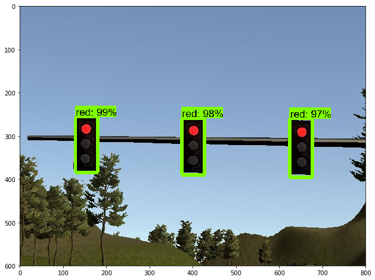
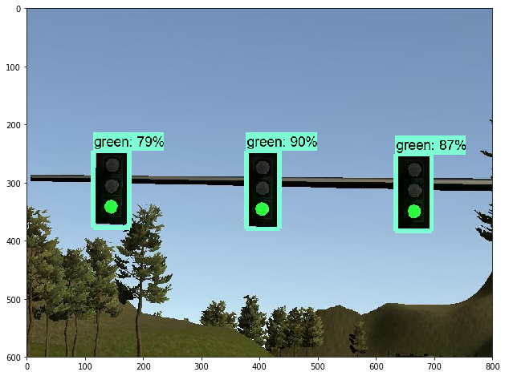
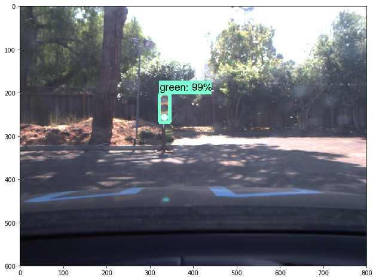
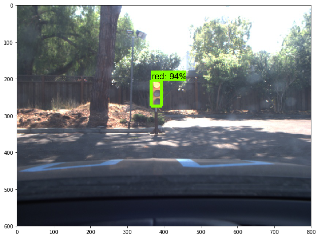

## <a name="top"></a> Capstone Project Project [](https://www.udacity.com/course/self-driving-car-engineer-nanodegree--nd013)

This is the project repo for the final project of the Udacity Self-Driving Car Nanodegree: Programming a Real Self-Driving Car. For more information about the project, see the project introduction [here](https://classroom.udacity.com/nanodegrees/nd013/parts/6047fe34-d93c-4f50-8336-b70ef10cb4b2/modules/e1a23b06-329a-4684-a717-ad476f0d8dff/lessons/462c933d-9f24-42d3-8bdc-a08a5fc866e4/concepts/5ab4b122-83e6-436d-850f-9f4d26627fd9).


## System Architecture
Description from Udacity Classroom
The following is a system architecture diagram showing the ROS nodes and topics used in the project. The ROS nodes and topics shown in the diagram are described briefly in the Code Structure section below.


### Discussion and Limitations
The car follows the track very well if the hardware is powerful enough. The results video was created on a MacBook Pro with 2,8 GHz Intel Core i7. ROS was executed in the Linux VM from Udacity using VMWare Fusion. The Simulator was executed natively in Mac.

First i did not manage to get the simulator running - as i noticed a delay between ROS and the simulator, which resulted leaving the Track. Refer to: 
[Issue-294](https://github.com/udacity/CarND-Capstone/issues/294).

After intensive search on Udacity-Slack, i found the same dicussion with the proposed performance-fix:
In order to reduce the load:
  * reduced the traffic light detection rate to 5 Hz
  * reduced the frequency if published images by the bridge to the simulator
  * disabled publishing of lidar and obstacles data
  
### Code Structure
Below is a brief overview of the repo structure, along with descriptions of the ROS nodes. 

#### Traffic Light Detection Node
This package contains the traffic light detection node.


See Python-Note for the training code in [/training/](https://github.com/essamabas/CarND/tree/master/Term2/CarND-Capstone/training/) and inference Model in 
[/ros/src/tl_detector/](https://github.com/essamabas/CarND-Capstone/tree/master/ros/src/tl_detector/).


#### Waypoint Updater Node
This package contains the waypoint updater node


See code in [/ros/src/waypoint_updater/](https://github.com/essamabas/CarND-Capstone/tree/master/ros/src/waypoint_updater/).


#### Drive By Wire (DBW) Node
Carla is equipped with a drive-by-wire (dbw) system, meaning the throttle, brake, and steering have electronic control. This package contains the files that are responsible for control of the vehicle


See code in [/ros/src/twist_controller/](https://github.com/essamabas/CarND-Capstone/tree/master/ros/src/twist_controller/).

#### ROS to Simulator Bridge Node
A package that contains a server for communicating with the simulator, and a bridge to translate and publish simulator messages to ROS topics.

See code in [/ros/src/styx/](https://github.com/essamabas/CarND-Capstone/tree/master/ros/src/styx/).

#### Waypoint Loader Node
A package which loads the static waypoint data and publishes to */base_waypoints*

See code in [/ros/src/waypoint_loader/](https://github.com/essamabas/CarND-Capstone/tree/master/ros/src/waypoint_loader/).

  
#### Waypoint Follower Node
A package containing code from [Autoware](https://github.com/CPFL/Autoware) which subscribes to */final_waypoints* and publishes target vehicle linear and angular velocities in the form of twist commands to the */twist_cmd* topic.

See code in [/ros/src/waypoint_follower/](https://github.com/essamabas/CarND-Capstone/tree/master/ros/src/waypoint_follower/).


## Traffic-Light Detection
### Training Steps:
The main part of the Traffic-Light Detection Node is a Traffic Light Detection and Classifier that has been implemented using
 [Tensor Flow Object Dection API](https://github.com/tensorflow/models/tree/master/research/object_detection).
 More about Trainning-Steps and Integration into the Code - can be found under: [/ros/src/tl_detector/light_classification/training/Traffic-Light-Detection.ipynb](https://github.com/essamabas/CarND/tree/master/Term2/CarND-Capstone//ros/src/tl_detector/light_classification/training/Traffic-Light-Detection.ipynb).


### Native Installation

* Be sure that your workstation is running Ubuntu 16.04 Xenial Xerus or Ubuntu 14.04 Trusty Tahir. [Ubuntu downloads can be found here](https://www.ubuntu.com/download/desktop).
* If using a Virtual Machine to install Ubuntu, use the following configuration as minimum:
  * 2 CPU
  * 2 GB system memory
  * 25 GB of free hard drive space

  The Udacity provided virtual machine has ROS and Dataspeed DBW already installed, so you can skip the next two steps if you are using this.

* Follow these instructions to install ROS
  * [ROS Kinetic](http://wiki.ros.org/kinetic/Installation/Ubuntu) if you have Ubuntu 16.04.
  * [ROS Indigo](http://wiki.ros.org/indigo/Installation/Ubuntu) if you have Ubuntu 14.04.
* [Dataspeed DBW](https://bitbucket.org/DataspeedInc/dbw_mkz_ros)
  * Use this option to install the SDK on a workstation that already has ROS installed: [One Line SDK Install (binary)](https://bitbucket.org/DataspeedInc/dbw_mkz_ros/src/81e63fcc335d7b64139d7482017d6a97b405e250/ROS_SETUP.md?fileviewer=file-view-default)
* Download the [Udacity Simulator](https://github.com/udacity/CarND-Capstone/releases).

### Docker Installation
[Install Docker](https://docs.docker.com/engine/installation/)

Build the docker container
```bash
docker build . -t capstone
```

Run the docker file
```bash
docker run -p 4567:4567 -v $PWD:/capstone -v /tmp/log:/root/.ros/ --rm -it capstone
```

### Port Forwarding
To set up port forwarding, please refer to the [instructions from term 2](https://classroom.udacity.com/nanodegrees/nd013/parts/40f38239-66b6-46ec-ae68-03afd8a601c8/modules/0949fca6-b379-42af-a919-ee50aa304e6a/lessons/f758c44c-5e40-4e01-93b5-1a82aa4e044f/concepts/16cf4a78-4fc7-49e1-8621-3450ca938b77)

### Usage

1. Clone the project repository
```bash
git clone https://github.com/udacity/CarND-Capstone.git
```

2. Install python dependencies
```bash
cd CarND-Capstone
pip install -r requirements.txt
```
3. Make and run styx
```bash
cd ros
catkin_make
source devel/setup.sh
roslaunch launch/styx.launch
```
4. Run the simulator

### Real world testing
1. Download [training bag](https://s3-us-west-1.amazonaws.com/udacity-selfdrivingcar/traffic_light_bag_file.zip) that was recorded on the Udacity self-driving car.
2. Unzip the file
```bash
unzip traffic_light_bag_file.zip
```
3. Play the bag file
```bash
rosbag play -l traffic_light_bag_file/traffic_light_training.bag
```
4. Launch your project in site mode
```bash
cd CarND-Capstone/ros
roslaunch launch/site.launch
```
5. Confirm that traffic light detection works on real life images

### Result:
 As mentioned in [Issue-294](https://github.com/udacity/CarND-Capstone/issues/294).
 There is a performance Issue in Simulator and ROS-Nodes that prevented /current-pose to sent on time; thus - the Car may get off-track, if there are no points to follow.
 
 Traffic-Light Detection in Simulation:




Traffic-Light Detection in Site:




 More about Trainning-Steps and Integration into the Code - can be found under: [/ros/src/tl_detector/light_classification/training/Traffic-Light-Detection.ipynb](https://github.com/essamabas/CarND/tree/master/Term2/CarND-Capstone//ros/src/tl_detector/light_classification/training/Traffic-Light-Detection.ipynb).

 A simulation-video can be found under: [/video](https://github.com/essamabas/CarND/tree/master/Term2/CarND-Capstone/video)

### Tips:

1. Catkin Packages not found

    ```bash
    $ catkin_make
    Traceback (most recent call last):
      File "/opt/ros/kinetic/bin/catkin_make", line 13, in <module>
        from catkin.terminal_color import disable_ANSI_colors, fmt
      File "/opt/ros/kinetic/lib/python2.7/dist-packages/catkin/terminal_color.py", line 2, in <module>
        from catkin_pkg.terminal_color import *  # noqa
    ImportError: No module named terminal_color
    ```
    i fixed it by running:
    ```bash
    pip install --upgrade catkin_pkg_modules
    ```
  2. dwb Messages are not found

      ```bash
      CMake Warning at /opt/ros/kinetic/share/catkin/cmake/catkinConfig.cmake:76 (find_package):
        Could not find a package configuration file provided by "dbw_mkz_msgs" with
        any of the following names:
      dbw_mkz_msgsConfig.cmake
          dbw_mkz_msgs-config.cmake
      Add the installation prefix of "dbw_mkz_msgs" to CMAKE_PREFIX_PATH or set
        "dbw_mkz_msgs_DIR" to a directory containing one of the above files.  If
        "dbw_mkz_msgs" provides a separate development package or SDK, be sure it
        has been installed.
      Call Stack (most recent call first):
        styx/CMakeLists.txt:10 (find_package)
      -- Could not find the required component 'dbw_mkz_msgs'. The following CMake error indicates that you either need to install the package with the same name or change your environment so that it can be found.
      CMake Error at /opt/ros/kinetic/share/catkin/cmake/catkinConfig.cmake:83 (find_package):
        Could not find a package configuration file provided by "dbw_mkz_msgs" with
        any of the following names:
      dbw_mkz_msgsConfig.cmake
          dbw_mkz_msgs-config.cmake
      Add the installation prefix of "dbw_mkz_msgs" to CMAKE_PREFIX_PATH or set
        "dbw_mkz_msgs_DIR" to a directory containing one of the above files.  If
        "dbw_mkz_msgs" provides a separate development package or SDK, be sure it
        has been installed.
      Call Stack (most recent call first):
        styx/CMakeLists.txt:10 (find_package)
      -- Configuring incomplete, errors occurred!
      See also "/home/workspace/CarND-Capstone/ros/build/CMakeFiles/CMakeOutput.log".
      See also "/home/workspace/CarND-Capstone/ros/build/CMakeFiles/CMakeError.log".
      Invoking "cmake" failed
      ```

      
    	• Use this option to install the SDK on a workstation that already has ROS installed: [One Line SDK Install (binary)](https://bitbucket.org/DataspeedInc/dbw_mkz_ros/src/81e63fcc335d7b64139d7482017d6a97b405e250/ROS_SETUP.md?fileviewer=file-view-default)

      • Install dbw-mks-msgs:
      ```bash
      sudo apt-get update
      sudo apt-get install -y ros-kinetic-dbw-mkz-msgs
      cd /home/workspace/CarND-Capstone/ros
      rosdep install --from-paths src --ignore-src --rosdistro=kinetic -y
      ```
  3. Camera Shape is out of Range

      ```bash
        File "/capstone/ros/src/styx/bridge.py", line 180, in publish_camera
        image_message = self.bridge.cv2_to_imgmsg(image_array, encoding="rgb8")
        File "/opt/ros/kinetic/lib/python2.7/dist-packages/cv_bridge/core.py", line 248, in cv2_to_imgmsg
        img_msg.height = cvim.shape[0]
        IndexError: tuple index out of range 
      ```

      Just Upgrade Pillow-Package
      ```bash
       pip install pillow --upgrade
      ```
