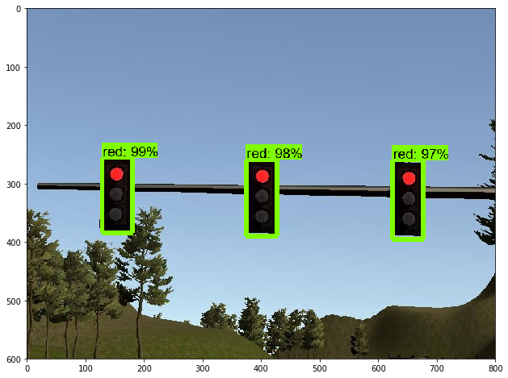
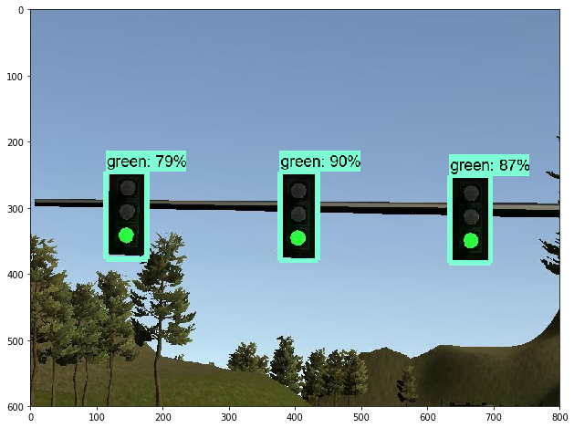

# Traffic-Light Detection

This is based on the Object-Detection starter from Tensor-Flow Object-Detection API.

This notebook will walk you step by step through the process of using a pre-trained model to detect objects in an image. Make sure to follow the [installation instructions](https://github.com/tensorflow/models/blob/master/research/object_detection/g3doc/installation.md) before you start.

# Imports


```python
import numpy as np
import os
import six.moves.urllib as urllib
import sys
import tarfile
import tensorflow as tf
import zipfile

from distutils.version import StrictVersion
from collections import defaultdict
from io import StringIO
from matplotlib import pyplot as plt
from PIL import Image

# This is needed since the notebook is stored in the object_detection folder.
sys.path.append("..")
from object_detection.utils import ops as utils_ops

if StrictVersion(tf.__version__) < StrictVersion('1.12.0'):
  raise ImportError('Please upgrade your TensorFlow installation to v1.12.*.')

```

## Env setup


```python
# This is needed to display the images.
%matplotlib inline

print(os.getcwd())
```

    D:\carND\Term2\CarND-Capstone\ros\src\tl_detector\light_classification\training
    

## Object detection imports
Here are the imports from the object detection module.


```python
from utils import label_map_util

from utils import visualization_utils as vis_util
```

    D:\carND\Term2\CarND-Capstone\ros\src\tl_detector\light_classification\training\utils\visualization_utils.py:26: UserWarning: matplotlib.pyplot as already been imported, this call will have no effect.
      import matplotlib; matplotlib.use('Agg')  # pylint: disable=multiple-statements
    

# Model preparation 

## Variables

Any model exported using the `export_inference_graph.py` tool can be loaded here simply by changing `PATH_TO_FROZEN_GRAPH` to point to a new .pb file.  

By default we use an "SSD with Mobilenet" model here. See the [detection model zoo](https://github.com/tensorflow/models/blob/master/research/object_detection/g3doc/detection_model_zoo.md) for a list of other models that can be run out-of-the-box with varying speeds and accuracies.


```python
# What model to download.
MODEL_NAME = 'ssd_inception_v2_coco_2018_01_28'
MODEL_FILE = MODEL_NAME + '.tar.gz'
DOWNLOAD_BASE = 'http://download.tensorflow.org/models/object_detection/'

# List of the strings that is used to add correct label for each box.
PATH_TO_LABELS = os.path.join('annotations', 'label_map.pbtxt')
```


```python
opener = urllib.request.URLopener()
opener.retrieve(DOWNLOAD_BASE + MODEL_FILE, MODEL_FILE)
tar_file = tarfile.open(MODEL_FILE)
for file in tar_file.getmembers():
  file_name = os.path.basename(file.name)
  if 'frozen_inference_graph.pb' in file_name:
    tar_file.extract(file, os.getcwd())
```

## Re-Train Model

### Steps:

1. Choose New Classifications:

    I choosed "ssd_inception_v2_coco" Model - because it gives a fair comprise of Performance and Detection accuracy.
    The following Code - downloads the Model directly into the working directory. Another Model may be used.

        Note: that `label_map.pbtxt` includes the traffic-light classification:

        - id:= 1 (RED)
        - id:=2 (Yellow)
        - id:=3 (Green)
        
2. Pre-Pare New Data: Tensorflow Object-Detection API requires the data to be in .record format.
   A dataset has been found on the Udacity-slack captured by a former SDCND student, who labeled images from the simulator as well the real-life track.
  [here](https://drive.google.com/file/d/0B-Eiyn-CUQtxdUZWMkFfQzdObUE/view)
  
  
3. Re-Configure Train Pipeline:

    Tensorflow Models API - includes a configuration file for each Model.
    An updated configuration can be found under [ssd_inception_v2_coco.config](https://github.com/essamabas/CarND/tree/master/Term2/CarND-Capstone/ros/src/tl_dector/light_classificatino/training/ssd_inception_v2_coco.config)
    
4. Re-Run Training
  

python train.py --logtostderr --train_dir=training/ --pipeline_config_path=ssd_inception_v2_coco.config

At this point in the tutorial i have selected a pre-trained object detection model, adapted an existing dataset or created your own and turned it into a TFRecord file, modified a model config file, and started training. However, it is still needed tosave the model and deploy it in your project.

5. Saving a Checkpoint Model (.ckpt) as a .pb File
Navigate back to your TensorFlow object detection folder and copy the export_inference_graph.py file into the folder containing your model config file.


```python

python export_inference_graph.py --input_type image_tensor --pipeline_config_path ./ssd_inception_v2_coco.config --trained_checkpoint_prefix ./models/train/model.ckpt-5000 --output_directory ./fine_tuned_model
```

After Re-Training the Model. i moved the created Model to integrate it into the Project.

## Load a (frozen) Tensorflow model into memory.


```python
# Path to frozen detection graph. This is the re-trained model that we created from last section.
PATH_TO_FROZEN_GRAPH = os.getcwd()+'/pre-trained-model/' + MODEL_NAME + '/sim_model.pb'

# List of the strings that is used to add correct label for each box.
PATH_TO_LABELS = os.path.join('annotations', 'label_map.pbtxt')
```


```python
detection_graph = tf.Graph()
with detection_graph.as_default():
  od_graph_def = tf.GraphDef()
  with tf.gfile.GFile(PATH_TO_FROZEN_GRAPH, 'rb') as fid:
    serialized_graph = fid.read()
    od_graph_def.ParseFromString(serialized_graph)
    tf.import_graph_def(od_graph_def, name='')
```

## Loading label map
Label maps map indices to category names, so that when our convolution network predicts `5`, we know that this corresponds to `airplane`.  Here we use internal utility functions, but anything that returns a dictionary mapping integers to appropriate string labels would be fine


```python
category_index = label_map_util.create_category_index_from_labelmap(PATH_TO_LABELS, use_display_name=True)
```

## Helper code


```python
def load_image_into_numpy_array(image):
  (im_width, im_height) = image.size
  return np.array(image.getdata()).reshape(
      (im_height, im_width, 3)).astype(np.uint8)
```

# Testing Model-Detection


```python
# For the sake of simplicity we will use only 2 images:
# image1.jpg
# image2.jpg
# If you want to test the code with your images, just add path to the images to the TEST_IMAGE_PATHS.
PATH_TO_TEST_IMAGES_DIR = 'test_images'
TEST_IMAGE_PATHS = [ os.path.join(PATH_TO_TEST_IMAGES_DIR, 'image{}.jpg'.format(i)) for i in range(1, 3) ]

# Size, in inches, of the output images.
IMAGE_SIZE = (12, 8)
```


```python
def run_inference_for_single_image(image, graph):
  with graph.as_default():
    with tf.Session() as sess:
      # Get handles to input and output tensors
      ops = tf.get_default_graph().get_operations()
      all_tensor_names = {output.name for op in ops for output in op.outputs}
      tensor_dict = {}
      for key in [
          'num_detections', 'detection_boxes', 'detection_scores',
          'detection_classes', 'detection_masks'
      ]:
        tensor_name = key + ':0'
        if tensor_name in all_tensor_names:
          tensor_dict[key] = tf.get_default_graph().get_tensor_by_name(
              tensor_name)
      if 'detection_masks' in tensor_dict:
        # The following processing is only for single image
        detection_boxes = tf.squeeze(tensor_dict['detection_boxes'], [0])
        detection_masks = tf.squeeze(tensor_dict['detection_masks'], [0])
        # Reframe is required to translate mask from box coordinates to image coordinates and fit the image size.
        real_num_detection = tf.cast(tensor_dict['num_detections'][0], tf.int32)
        detection_boxes = tf.slice(detection_boxes, [0, 0], [real_num_detection, -1])
        detection_masks = tf.slice(detection_masks, [0, 0, 0], [real_num_detection, -1, -1])
        detection_masks_reframed = utils_ops.reframe_box_masks_to_image_masks(
            detection_masks, detection_boxes, image.shape[1], image.shape[2])
        detection_masks_reframed = tf.cast(
            tf.greater(detection_masks_reframed, 0.5), tf.uint8)
        # Follow the convention by adding back the batch dimension
        tensor_dict['detection_masks'] = tf.expand_dims(
            detection_masks_reframed, 0)
      image_tensor = tf.get_default_graph().get_tensor_by_name('image_tensor:0')

      # Run inference
      output_dict = sess.run(tensor_dict,
                             feed_dict={image_tensor: image})

      # all outputs are float32 numpy arrays, so convert types as appropriate
      output_dict['num_detections'] = int(output_dict['num_detections'][0])
      output_dict['detection_classes'] = output_dict[
          'detection_classes'][0].astype(np.int64)
      output_dict['detection_boxes'] = output_dict['detection_boxes'][0]
      output_dict['detection_scores'] = output_dict['detection_scores'][0]
      if 'detection_masks' in output_dict:
        output_dict['detection_masks'] = output_dict['detection_masks'][0]
  return output_dict
```


```python
for image_path in TEST_IMAGE_PATHS:
  image = Image.open(image_path)
  # the array based representation of the image will be used later in order to prepare the
  # result image with boxes and labels on it.
  image_np = load_image_into_numpy_array(image)
  # Expand dimensions since the model expects images to have shape: [1, None, None, 3]
  image_np_expanded = np.expand_dims(image_np, axis=0)
  # Actual detection.
  output_dict = run_inference_for_single_image(image_np_expanded, detection_graph)
  # Visualization of the results of a detection.
  vis_util.visualize_boxes_and_labels_on_image_array(
      image_np,
      output_dict['detection_boxes'],
      output_dict['detection_classes'],
      output_dict['detection_scores'],
      category_index,
      instance_masks=output_dict.get('detection_masks'),
      use_normalized_coordinates=True,
      line_thickness=8)
  plt.figure(figsize=IMAGE_SIZE)
  plt.imshow(image_np)
```







